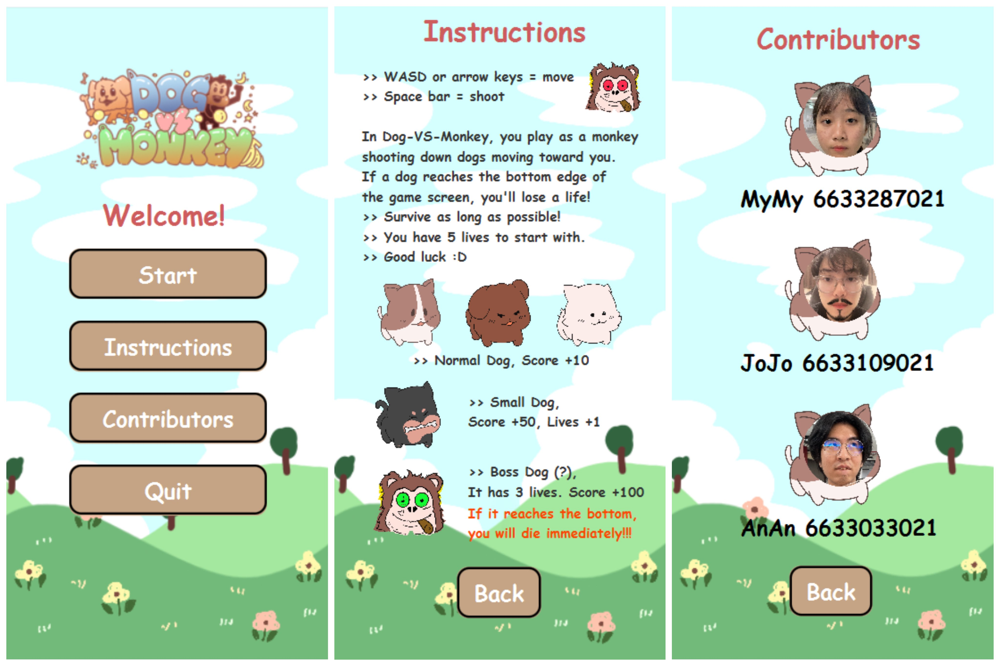
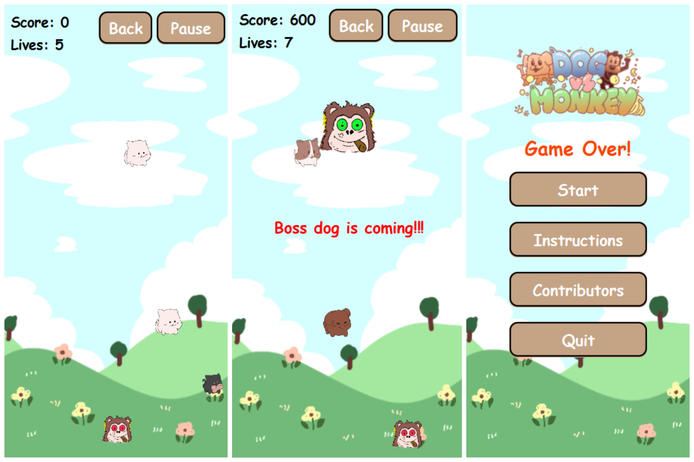

# Dog VS Monkey Game JavaFX 🐶🙉
Dog VS Monkey is a shooting game to overcome a dog that spawn and move down to monkey. You are the monkey in this game and you have to shoot every dogs that coming to you as soon as
possible cause dogs are so cruel!!!! ≽^•⩊•^≼

## User Interface 🎭

### Main Menu 🐕
<p style="cursor: pointer">
    
</p>

### Gameplay 🐒

<p style="cursor: pointer">
    
</p>

## Prerequisites 🦴
- JDK 11 or higher.
- JavaFX SDK (version compatible with your JDK).

## Setup and Installation 🍌
1. **JavaFX SDK**: Download the JavaFX SDK from [OpenJFX](https://openjfx.io/) and extract it to a known directory.
2. **Clone the Repository**: Use this command to clone this repository to your local machine.
```sh 
git clone https://github.com/amphikapha/Dog-VS-Monkey.git
```

## Configuration 🚨
Ensure JavaFX is correctly set up in your development environment:
- **IntelliJ IDEA**:
    1. Go to `File` > `Project Structure` > `Libraries`, add the JavaFX SDK as a library by navigating to its `lib` folder.
    2. Modify your run configuration to include VM options for the JavaFX modules you use, e.g., `--module-path "path/to/javafx-sdk/lib" --add-modules javafx.controls,javafx.fxml,javafx.media`.

## Running the Application 🎮
Compile and run the `Main.java` file. Ensure the VM options are set correctly to include the JavaFX library path and modules.
- **for jar file**: open terminal and cd to the directory of jar file and use this command to run jar file
```sh
java -jar --module-path "path/to/javafx-sdk/lib" --add-modules javafx.controls,javafx.fxml,javafx.media Dog-Vs-Monkey.jar
``` 


## How to Play 🕹️
- Use WASD or arrow keys to move your monkey.
- Press SPACE to shoot at dogs.
- Avoid letting dogs reach the bottom of the screen.
- Shoot Small Dog to increase your lives.
- The game ends when all lives are lost or letting Boss Dog down.

## Demo 📺
Watch the demo video on [YouTube](https://www.youtube.com/watch?v=cFkica9elyI) to see the game in action

## Contributors 🤸‍♀️🏋️‍♂️🚴‍♂️
- [MyMy](https://github.com/amphikapha)
- [AnAn](https://github.com/Chulinuwu)
- [JoJo](https://github.com/thipbadee)